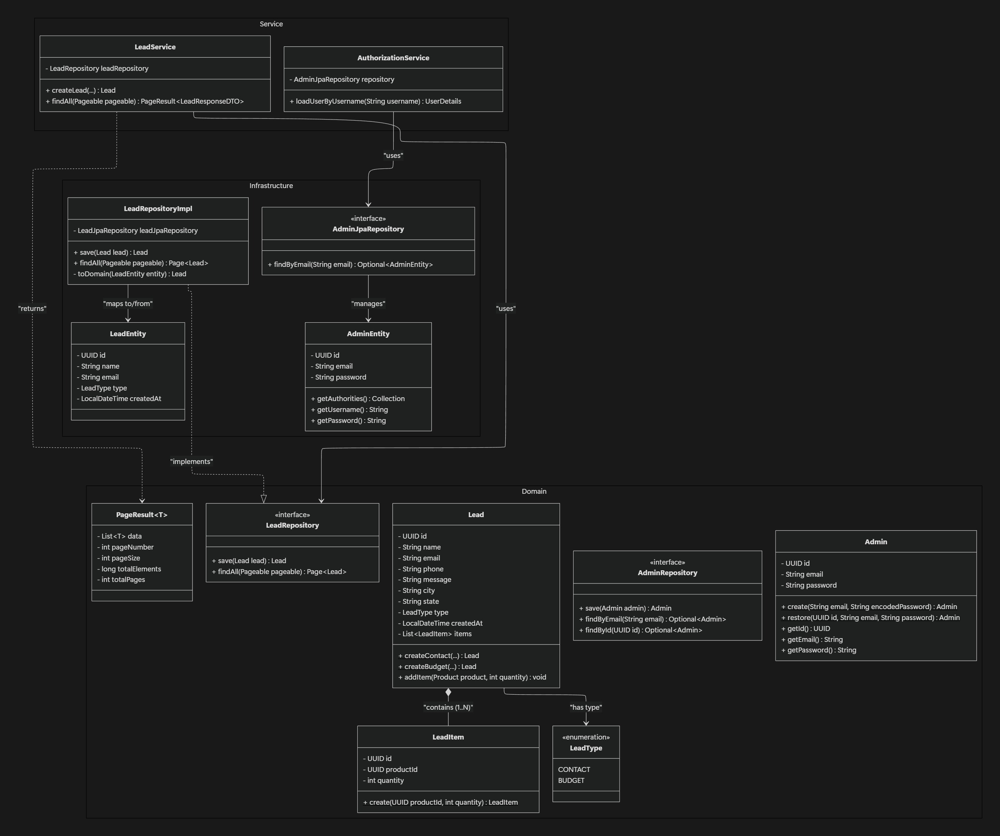
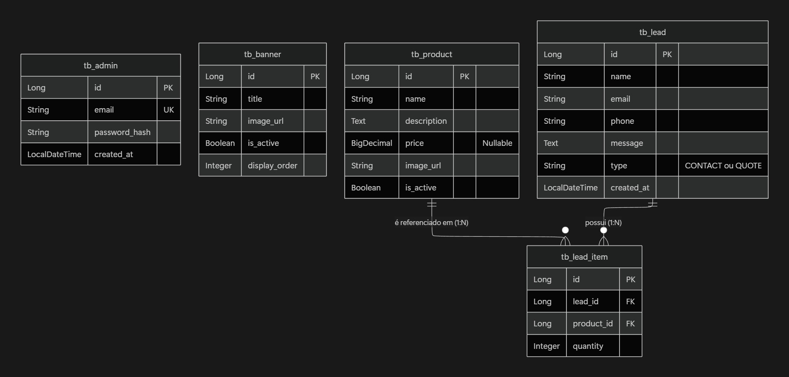

# 💎 Vitally - E-commerce API

> Motor backend de alta performance para a plataforma de e-commerce e gestão de leads da Vitally.

Este projeto expõe uma API RESTful robusta desenhada para gerir o catálogo de produtos de alto valor, captação de leads (orçamentos e contatos) e banners dinâmicos, com um sistema de autenticação seguro para administradores.

## 🏗️ Arquitetura e Padrões

O projeto foi rigorosamente desenhado com foco em manutenibilidade, escalabilidade e isolamento de responsabilidades, liderado pela visão de coordenação e arquitetura de software. O padrão central adotado é a **Arquitetura Hexagonal (Ports and Adapters)**.

* **Arquitetura Hexagonal (Ports & Adapters):**
    * O núcleo do negócio (`domain`) está totalmente isolado de frameworks e tecnologias externas.
    * **Ports (Portas):** Interfaces no domínio (ex: `LeadRepository`) definem os contratos que a aplicação precisa para funcionar.
    * **Adapters (Adaptadores):** Implementações na infraestrutura (ex: `LeadRepositoryImpl` usando Spring Data JPA) "ligam-se" a estas portas, garantindo que o banco de dados é apenas um detalhe técnico substituível.
* **Domain-Driven Design (DDD):** A modelagem foca-se nas entidades reais do negócio e nos seus casos de uso (`Services`).
* **SOLID Principles:** Código coeso, acoplamento reduzido e injeção de dependências.
* **Padronização de Erros:** Interceção global de exceções (GlobalExceptionHandler) garantindo respostas uniformes (RFC 7807 StandardError).

### Diagrama de Classes (Arquitetura Hexagonal)


## 🚀 Tecnologias e Stack

* **Linguagem:** Java 21
* **Framework:** Spring Boot 3.x (Web, Data JPA, Security, Validation)
* **Banco de Dados:** PostgreSQL 15
* **Migrações:** Flyway
* **Segurança:** Spring Security + Auth0 JWT (JSON Web Tokens) + BCrypt
* **Infraestrutura:** Docker & Docker Compose

## 🗄️ Modelo de Dados (ERD)

A base de dados relacional foi modelada para garantir integridade e performance nas consultas.



## ⚙️ Configuração do Ambiente de Desenvolvimento

### 1. Pré-requisitos
* [Java 21 JDK](https://adoptium.net/)
* [Maven](https://maven.apache.org/)
* [Docker](https://www.docker.com/) e Docker Compose

### 2. Variáveis de Ambiente (.env)
Crie um ficheiro `.env` na raiz do projeto contendo as credenciais do banco e a chave secreta do JWT:

```env
DB_URL=jdbc:postgresql://localhost:5433/vitally_db
DB_USER=vitally_admin
DB_PASS=sua_senha_segura
JWT_SECRET=chave-secreta-para-desenvolvimento-local-2026
```

### 3. Subir o Banco de Dados
Utilize o Docker Compose para iniciar a instância do PostgreSQL:

```bash
docker-compose up -d
```

### 4. Executar a Aplicação
O Flyway encarrega-se automaticamente de criar as tabelas e injetar o primeiro Administrador (admin@vitally.com.br) na inicialização.

```bash
./mvnw spring-boot:run
```

A API estará disponível em: `http://localhost:8080/api/v1/`

## 🔒 Autenticação e Rotas Protegidas
A API utiliza Bearer Tokens (JWT) para proteger rotas sensíveis.

1. Faça uma requisição `POST` para `/api/v1/auth/login` com as credenciais do administrador.
2. Capture o token devolvido no JSON.
3. Nas rotas protegidas (ex: criar produtos, listar leads), inclua o token no Header HTTP: `Authorization: Bearer <seu_token_jwt>`

## 👨‍💻 Autor
Ryan Tofanini — Software Architect & Project Coordinator